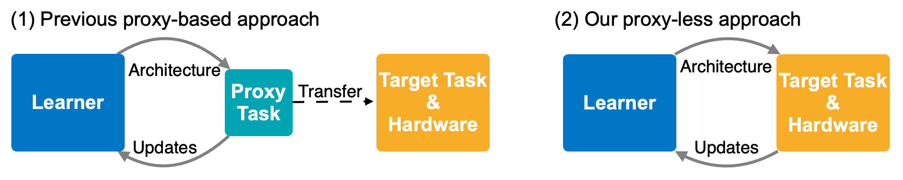

# ProxylessNAS: Direct Neural Architecture Search on Target Task and Hardware 
[Han Cai](http://han-cai.github.io), [Ligeng Zhu](http://lzhu.me), [Song Han](http://songhan.mit.edu). 

With any proxy, direct search neural network architectures on your target **task** and **hardware**! 



Note: our code is developed in PyTorch 0.3, and has been tested in both 0.3 and 0.4.

## Performance 
| Model                | Top-1    | Top-5    | Latency | 
|----------------------|----------|----------|---------|
| MobilenetV1          | 70.6     | 89.5     | 113ms   | 
| MobilenetV2          | 71.8     | 91.0     | 75ms    |
| Proxyless-NAS (mobile) | 74.6   | 92.2     | 78ms    |
| Proxyless-NAS (CPU)    | 75.3 | 92.4 | 116ms    | 
| Proxyless-NAS (GPU)    | 75.1 | 92.5 | 124ms    | 

For more results, please refer to our paper.
 
## How to use / evaluate 
* Use
    ```python
    from proxyless_nas import proxyless_cpu, proxyless_gpu, proxyless_mobile
    net = proxyless_cpu(pretrained=True) # Yes, we provide pre-trained models!
    ```
* Evaluate

    `python eval.py --path 'Your path to imagent' --arch proxyless_cpu`
