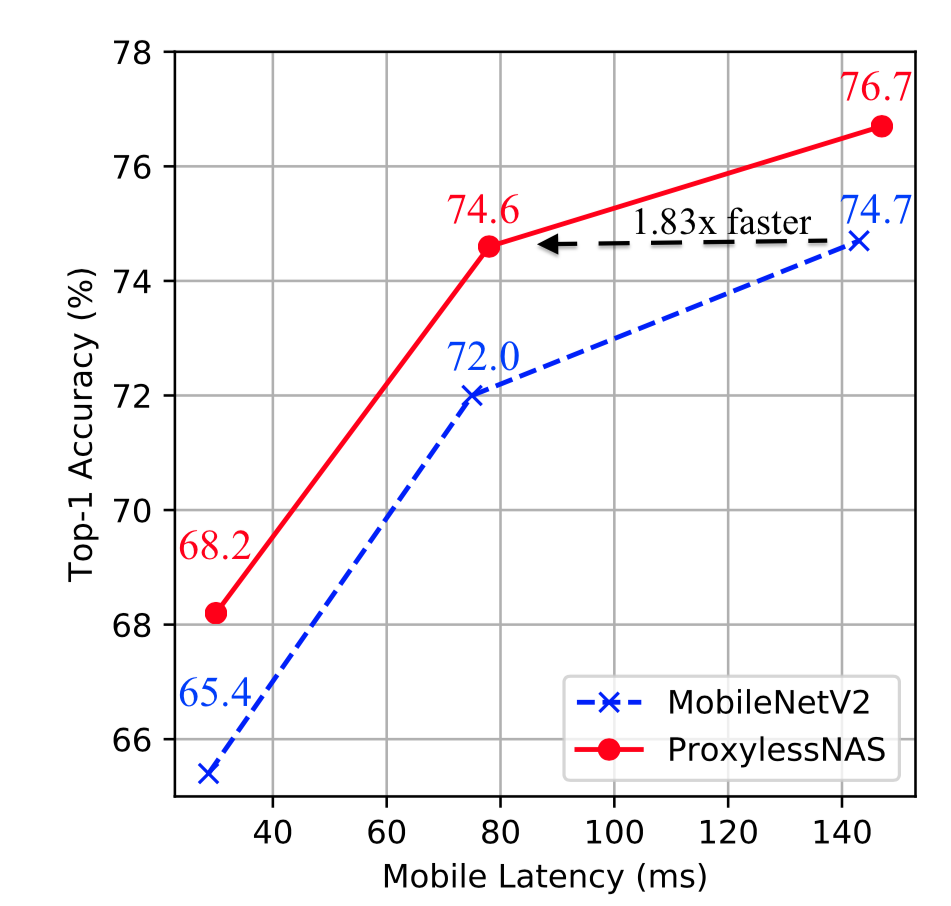

# ProxylessNAS: Direct Neural Architecture Search on Target Task and Hardware 
[Han Cai](http://han-cai.github.io), [Ligeng Zhu](http://lzhu.me), [Song Han](http://songhan.mit.edu). 

With any proxy, direct search neural network architectures on your target **task** and **hardware**! 


Note: our code is developed in PyTorch 0.3, and has been tested in both 0.3 and 0.4.

## Performance
<table>
<tr><th> Mobile settings </th><th> GPU settings </th></tr>
<tr><td> 

| Model                | Top-1    | Top-5    | Latency | 
|----------------------|----------|----------|---------|
| MobilenetV1          | 70.6     | 89.5     | 113ms   | 
| MobilenetV2          | 71.8     | 91.0     | 75ms    |
| MNasNet(our impl) | 74.0 | 91.8 | 79ms
| Proxyless-NAS (mobile) | 74.6   | 92.2     | 78ms    |

</td><td>

| Model                | Top-1    | Top-5    | Latency | 
|----------------------|----------|----------|---------| 
| MobilenetV2          | 71.8     | 91.0     | 6.1ms    |
| ShufflenetV2(1.5)    | 72.6     | -        | 7.3ms    |
| ResNet-34       | 73.3     | 91.4      | 8.0ms    |
| MNasNet(our impl) | 74.0 | 91.8 | 6.1s
| Proxyless-NAS (GPU) | 75.1   | 92.5     | 5.1ms    |
</td></tr> </table>




Please refer to our paper for more results.
 
## How to use / evaluate 
* Use
    ```python
    from proxyless_nas import proxyless_cpu, proxyless_gpu, proxyless_mobile
    net = proxyless_cpu(pretrained=True) # Yes, we provide pre-trained models!
    ```
* Evaluate

    `python eval.py --path 'Your path to imagent' --arch proxyless_cpu`
